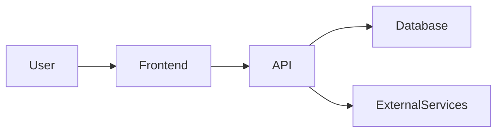

# AUDITORIA, REFATORAÇÃO E PREPARAÇÃO PROFISSIONAL DO PROJETO PARA GITHUB

## CONTEXTO

Quero transformar este projeto em um **repositório profissional, apresentável e tecnicamente maduro no GitHub**, com padrão compatível com um desenvolvedor experiente/sênior.

O objetivo NÃO é reconstruir a aplicação e NÃO é alterar sua lógica de negócio.

O objetivo é realizar uma **auditoria completa do projeto**, identificar problemas de organização, código morto, arquivos desnecessários, resíduos de ferramentas utilizadas durante o desenvolvimento, inconsistências arquiteturais e problemas de documentação, e então corrigir esses pontos com segurança.

O resultado final deve parecer um projeto que foi:

- planejado;
- arquitetado;
- desenvolvido de forma profissional;
- revisado;
- documentado;
- preparado para manutenção por outros desenvolvedores;
- preparado para ser apresentado em um portfólio técnico/GitHub.

A aplicação deve continuar funcionando **exatamente como antes**.

---

# REGRA PRINCIPAL — NÃO QUEBRAR NADA

Esta é a prioridade máxima de todo o trabalho.

> **NENHUMA funcionalidade existente pode ser removida, alterada ou quebrada apenas para melhorar a organização ou apresentação do projeto.**

Não faça alterações destrutivas sem comprovar que são seguras.

Não remova algo apenas porque:

- parece desnecessário;
- parece duplicado;
- não é utilizado diretamente;
- não aparece em uma busca simples;
- parece antigo;
- parece relacionado ao Lovable;
- parece código morto.

Antes de remover qualquer coisa, determine se existe alguma dependência direta ou indireta.

Considere:

- imports;
- dynamic imports;
- rotas;
- API routes;
- Server Actions;
- componentes carregados dinamicamente;
- configuração;
- variáveis de ambiente;
- scripts;
- aliases;
- middleware;
- providers;
- hooks;
- serviços;
- funções utilizadas por outras funções;
- arquivos utilizados em build;
- arquivos utilizados em deploy;
- arquivos utilizados pelo framework;
- assets referenciados por CSS;
- assets referenciados por configuração;
- arquivos referenciados por banco de dados;
- arquivos referenciados por serviços externos;
- integrações;
- webhooks;
- autenticação;
- storage;
- jobs;
- cron jobs;
- migrations;
- seeds;
- templates;
- e qualquer outro mecanismo indireto.

---

# FASE 0 — NÃO ALTERE NADA AINDA

Antes de modificar qualquer arquivo, faça uma **auditoria inicial completa do projeto**.

Primeiro compreenda o sistema.

Analise:

- estrutura de diretórios;
- stack;
- framework;
- arquitetura;
- frontend;
- backend;
- banco de dados;
- autenticação;
- integrações externas;
- APIs;
- serviços;
- componentes;
- páginas;
- rotas;
- hooks;
- utilitários;
- tipos;
- configurações;
- scripts;
- assets;
- documentação;
- arquivos de ambiente;
- dependências;
- sistema de build;
- sistema de deploy.

Determine também:

1. Qual é o propósito da aplicação?
2. Quais são as principais funcionalidades?
3. Qual é o fluxo principal do usuário?
4. Qual é a arquitetura atual?
5. Quais tecnologias são utilizadas?
6. Quais serviços externos são utilizados?
7. Como os dados circulam pelo sistema?
8. Quais partes são críticas?
9. Quais arquivos parecem ser código legado?
10. Quais arquivos parecem ter sido gerados automaticamente?
11. Quais arquivos parecem ter sido deixados por ferramentas como Lovable?
12. Existem arquivos duplicados?
13. Existem componentes aparentemente abandonados?
14. Existem dependências que não parecem ser utilizadas?
15. Existem assets que não possuem nenhuma referência?
16. Existem configurações obsoletas?
17. Existem comentários ou TODOs esquecidos?
18. Existem trechos de código claramente mortos?
19. Existem arquivos de teste ou debug esquecidos?
20. Existem informações de desenvolvimento que não deveriam estar no repositório?

NÃO faça mudanças nesta fase.

Primeiro compreenda.

---

# FASE 1 — MAPA DA ARQUITETURA

Depois da auditoria inicial, construa mentalmente um mapa completo da aplicação.

Identifique as camadas existentes.

Por exemplo:

```text
Application
├── Presentation
├── Components
├── Pages / Routes
├── Hooks
├── Services
├── API
├── Business Logic
├── Data Access
├── Database
├── Authentication
├── Integrations
├── Utilities
└── Configuration
```

Não force essa estrutura literalmente.

A arquitetura deve refletir o projeto real.

O objetivo é descobrir:

- onde cada responsabilidade está;
- se existem responsabilidades misturadas;
- se existem arquivos fora do lugar;
- se existem componentes excessivamente grandes;
- se existem funções que deveriam estar em outra camada;
- se existem abstrações desnecessárias;
- se existem duplicações.

---

# FASE 2 — AUDITORIA DE ARQUIVOS

Faça uma análise arquivo por arquivo.

Classifique cada arquivo como:

### 1. ESSENCIAL

Arquivo necessário para o funcionamento da aplicação.

### 2. UTILIZADO

Arquivo utilizado pela aplicação, mas não necessariamente crítico.

### 3. CONFIGURAÇÃO

Arquivos necessários para desenvolvimento, build, deploy ou ferramentas.

### 4. DOCUMENTAÇÃO

README, documentação técnica, etc.

### 5. POSSIVELMENTE OBSOLETO

Arquivo que parece não ser utilizado, mas cuja remoção ainda precisa ser validada.

### 6. CÓDIGO MORTO

Código comprovadamente não utilizado.

### 7. ARQUIVO RESIDUAL

Arquivo deixado por alguma ferramenta, experimento ou processo de desenvolvimento.

### 8. ARQUIVO SENSÍVEL

Arquivo que contém ou pode conter:

- secrets;
- tokens;
- chaves;
- credenciais;
- informações privadas;
- configurações locais.

### 9. ARQUIVO DE DESENVOLVIMENTO

Arquivo útil localmente, mas que talvez não deva fazer parte do repositório.

Não remova imediatamente.

Primeiro faça a análise de dependências.

---

# FASE 3 — LIMPEZA DE CÓDIGO MORTO

Procure sistematicamente por:

- componentes não utilizados;
- páginas antigas;
- rotas abandonadas;
- hooks não utilizados;
- funções não utilizadas;
- constantes não utilizadas;
- tipos não utilizados;
- interfaces não utilizadas;
- imports não utilizados;
- arquivos duplicados;
- funções duplicadas;
- componentes duplicados;
- serviços antigos;
- código comentado;
- blocos de código abandonados;
- console.logs de debug;
- console.error utilizados apenas durante desenvolvimento;
- alertas temporários;
- mocks esquecidos;
- dados fake;
- arrays hardcoded utilizados apenas em protótipos;
- TODOs antigos;
- FIXME;
- hacks temporários;
- arquivos com nomes genéricos;
- componentes "Test", "Example", "Demo", "Old", "Backup", "Temp", "New", etc.

Procure também padrões como:

```text
ComponentOld
ComponentNew
Component2
ComponentFinal
ComponentFinal2
test.tsx
backup.ts
temp.ts
example.tsx
demo.tsx
```

Mas NÃO remova apenas com base no nome.

Verifique utilização real.

---

# FASE 4 — AUDITORIA DE DEPENDÊNCIAS

Analise o package manager utilizado pelo projeto.

Identifique:

- dependências utilizadas;
- dependências não utilizadas;
- dependências duplicadas;
- dependências provavelmente herdadas;
- dependências utilizadas apenas por ferramentas;
- dependências utilizadas apenas durante desenvolvimento.

Antes de remover uma dependência, verifique:

- imports;
- configuração;
- scripts;
- plugins;
- build;
- lint;
- testes;
- bundler;
- framework;
- deploy.

Não remova uma dependência simplesmente porque ela não aparece em um componente.

Ela pode ser necessária indiretamente.

Se existir alguma dúvida razoável, NÃO remova.

---

# FASE 5 — LIMPEZA DE ASSETS

Faça uma auditoria dos assets.

Analise:

- imagens;
- SVGs;
- ícones;
- fontes;
- vídeos;
- arquivos JSON;
- arquivos estáticos;
- logos;
- screenshots;
- favicons;
- assets duplicados.

Identifique:

- assets não utilizados;
- duplicados;
- versões antigas;
- imagens de teste;
- imagens temporárias;
- assets gerados automaticamente;
- arquivos com nomes genéricos.

Tenha atenção especial a assets referenciados por:

- CSS;
- Tailwind;
- configuração;
- metadata;
- manifest;
- Open Graph;
- favicon;
- componentes;
- rotas;
- HTML;
- frameworks.

Não remova assets apenas porque não encontrou uma referência simples.

---

# FASE 6 — REMOVER VESTÍGIOS DO LOVABLE

Faça uma auditoria específica procurando vestígios de desenvolvimento utilizando Lovable.

Procure por:

- comentários;
- arquivos;
- componentes;
- nomes;
- configurações;
- dependências;
- textos;
- referências;
- metadata;
- documentação;
- estrutura artificial;
- arquivos gerados;
- prompts;
- instruções;
- referências a Lovable;
- referências a ferramentas de geração automática;
- artefatos que façam o projeto parecer um protótipo gerado por IA.

Exemplos de coisas que devem ser investigadas:

```text
lovable
Lovable
generated
Generated
AI generated
ai-generated
TODO
FIXME
temporary
temp
backup
old
test
demo
example
```

Também procure por comentários ou documentação que revelem processos internos de geração ou prototipação que não fazem parte da documentação técnica do produto.

### IMPORTANTE

Não remova qualquer coisa apenas por conter uma palavra suspeita.

Determine primeiro se aquilo possui função técnica.

O objetivo é remover **vestígios de ferramenta**, não apagar funcionalidades.

O GitHub final deve apresentar o projeto como um software profissional, e não como um projeto deixado diretamente por uma ferramenta de geração.

---

# FASE 7 — ORGANIZAÇÃO DE PASTAS

Avalie se a estrutura de diretórios está coerente.

Procure por:

- arquivos na pasta errada;
- componentes espalhados;
- utilitários espalhados;
- serviços espalhados;
- tipos espalhados;
- configurações duplicadas;
- pastas sem propósito;
- pastas excessivamente profundas;
- estruturas artificiais;
- nomes inconsistentes.

Se necessário, reorganize os arquivos.

Porém:

> **Ao mover arquivos, atualize todos os imports e referências necessários.**

Não faça reorganização puramente estética que aumente a complexidade.

A estrutura deve favorecer:

- descoberta;
- manutenção;
- escalabilidade;
- separação de responsabilidades;
- onboarding de novos desenvolvedores.

---

# FASE 8 — PADRONIZAÇÃO DE NOMES

Padronize nomes inconsistentes.

Analise:

- arquivos;
- pastas;
- componentes;
- hooks;
- funções;
- variáveis;
- serviços;
- tipos;
- interfaces;
- constantes.

Respeite a convenção já adotada pelo projeto e pelo framework.

Não renomeie indiscriminadamente.

Priorize nomes que:

- sejam claros;
- sejam semanticamente corretos;
- expressem responsabilidade;
- sejam consistentes.

Evite nomes como:

```text
data
data2
newData
temp
thing
helper
utils2
component
test
foo
bar
```

quando houver contexto suficiente para utilizar nomes melhores.

---

# FASE 9 — REVISÃO DE COMPONENTES E RESPONSABILIDADES

Identifique componentes excessivamente grandes.

Por exemplo, um componente contendo simultaneamente:

- UI;
- chamadas de API;
- regras de negócio;
- validação;
- manipulação de estado;
- transformação de dados;
- persistência.

Avalie se existe uma separação razoável.

Porém:

> NÃO faça uma refatoração arquitetural gigantesca apenas para "deixar bonito".

A prioridade é:

1. preservar comportamento;
2. reduzir complexidade;
3. melhorar legibilidade;
4. melhorar manutenção;
5. evitar duplicação;
6. manter a arquitetura compreensível.

Se uma refatoração tiver risco significativo de alterar comportamento, não faça automaticamente.

---

# FASE 10 — SEGURANÇA DO REPOSITÓRIO

Faça uma auditoria de segurança antes de finalizar.

Procure por:

- API keys;
- tokens;
- passwords;
- secrets;
- private keys;
- credentials;
- access tokens;
- URLs internas;
- informações privadas;
- arquivos `.env`;
- dumps;
- arquivos de banco;
- certificados;
- arquivos locais;
- dados reais de usuários.

Verifique:

```text
.env
.env.local
.env.development
.env.production
.env.test
```

e outras variações.

Garanta que secrets não estejam versionados.

Se necessário:

- remova secrets do código;
- substitua por environment variables;
- atualize `.gitignore`;
- crie `.env.example`;
- documente quais variáveis são necessárias.

NUNCA coloque secrets reais no `.env.example`.

---

# FASE 11 — GITIGNORE

Revise completamente o `.gitignore`.

Ele deve impedir que o repositório receba:

- node_modules;
- builds;
- caches;
- arquivos locais;
- secrets;
- logs;
- arquivos temporários;
- arquivos do sistema operacional;
- arquivos de IDE;
- arquivos gerados;
- artefatos de build;
- arquivos específicos da máquina do desenvolvedor.

Mas não coloque no `.gitignore` arquivos necessários para executar ou entender o projeto.

---

# FASE 12 — CONFIGURAÇÃO E METADATA

Revise arquivos como:

- package.json;
- lockfile;
- tsconfig;
- eslint;
- prettier;
- vite;
- next.config;
- tailwind;
- postcss;
- vite.config;
- configuração do banco;
- configuração de deploy;
- manifest;
- metadata;
- configuração de testes.

Não altere configurações sem necessidade.

O objetivo é remover:

- configurações mortas;
- plugins sem uso;
- scripts abandonados;
- referências a ferramentas antigas;
- configurações duplicadas.

Preserve tudo que for necessário para:

- desenvolvimento;
- build;
- testes;
- deploy;
- produção.

---

# FASE 13 — README PROFISSIONAL

Depois que o projeto estiver organizado, crie um README.md profissional.

O README deve parecer documentação de um projeto real de portfólio profissional.

Não faça um README genérico.

Ele deve ser baseado na aplicação real.

Estruture aproximadamente assim:

# Nome do Projeto

Uma descrição objetiva e profissional do sistema.

## Sobre o projeto

Explique:

- qual problema resolve;
- para quem foi desenvolvido;
- qual é o propósito;
- quais são suas principais características.

Evite linguagem exagerada de marketing.

---

## Funcionalidades

Liste as funcionalidades reais.

Exemplo:

- Autenticação;
- Gestão de usuários;
- Dashboard;
- CRUD;
- Integração com API;
- Upload de arquivos;
- Sistema de pagamentos;
- Notificações;
- etc.

NÃO invente funcionalidades.

---

## Stack

Organize por categoria.

### Frontend

- Tecnologia
- Framework
- UI
- Estado
- Formulários

### Backend

- Runtime
- Framework
- API

### Banco de dados

- Banco
- ORM
- Migrations

### Infraestrutura

- Deploy
- Storage
- Serviços externos

### Ferramentas

- Git
- Lint
- Testes
- etc.

Use somente tecnologias realmente presentes no projeto.

---

## Arquitetura

Explique a arquitetura real da aplicação.

Inclua um diagrama Mermaid quando isso realmente ajudar.

Por exemplo:



O diagrama deve refletir o sistema real.

NÃO invente arquitetura.

---

## Estrutura do projeto

Mostre uma árvore resumida.

Exemplo:

```text
src/
├── components/
├── features/
├── hooks/
├── services/
├── lib/
├── types/
└── ...
```

Não coloque cada arquivo do projeto.

Mostre apenas as partes relevantes.

Explique brevemente as principais pastas.

---

## Fluxo da aplicação

Explique os principais fluxos.

Por exemplo:

```text
Usuário
   ↓
Autenticação
   ↓
Dashboard
   ↓
Ação
   ↓
API
   ↓
Banco de dados
```

Utilize somente fluxos que realmente existem.

---

## Instalação

Explique passo a passo como executar o projeto localmente.

Exemplo:

```bash
git clone ...
cd ...
npm install
```

Depois explique as variáveis de ambiente.

---

## Variáveis de ambiente

Documente todas as variáveis necessárias.

Exemplo:

```env
DATABASE_URL=
API_URL=
PUBLIC_KEY=
```

Nunca exponha valores reais.

Explique brevemente o propósito de cada variável.

---

## Desenvolvimento

Inclua os comandos reais disponíveis no projeto.

Por exemplo:

```bash
npm run dev
npm run build
npm run lint
npm run test
```

Não invente scripts.

---

## Build e Deploy

Explique como a aplicação é construída e, quando aplicável, como é publicada.

Se o projeto utiliza Vercel, Netlify, Supabase ou outro serviço, documente somente aquilo que realmente existe.

---

## Banco de dados

Se existir banco de dados, explique:

- tecnologia;
- ORM;
- migrations;
- seed;
- principais entidades;
- relacionamento geral.

Não exponha credenciais.

---

## Integrações

Documente APIs e serviços externos realmente utilizados.

Para cada integração, explique brevemente sua função.

---

## Decisões técnicas

Inclua uma seção curta explicando decisões relevantes.

Exemplos:

- por que determinada tecnologia foi escolhida;
- como a autenticação funciona;
- como os dados são persistidos;
- como o sistema é organizado;
- como determinada integração foi implementada.

Essa seção deve demonstrar maturidade técnica.

---

## Desafios técnicos

Quando houver desafios reais e relevantes, documente-os.

Exemplo:

- integração entre sistemas;
- autenticação;
- pagamentos;
- processamento de dados;
- performance;
- segurança;
- sincronização;
- arquitetura.

Não invente dificuldades.

---

## Screenshots

Se houver screenshots reais e relevantes, organize uma seção visual.

Use imagens reais do projeto.

Não crie screenshots falsas.

---

## Status

Informe o estado real:

```text
Em desenvolvimento
```

ou

```text
Concluído
```

ou outro status apropriado.

---

## Roadmap

Somente se houver melhorias futuras reais.

Não crie um roadmap artificial.

---

## Licença

Inclua somente se fizer sentido para o projeto.

---

# FASE 14 — README VOLTADO PARA RECRUTADORES E DESENVOLVEDORES

O README deve funcionar para dois públicos:

### Recrutador

Deve conseguir entender rapidamente:

- o que é o projeto;
- o que ele faz;
- quais tecnologias foram utilizadas;
- qual é a complexidade;
- qual foi o nível de responsabilidade técnica.

### Desenvolvedor

Deve conseguir entender:

- como executar;
- arquitetura;
- estrutura;
- dependências;
- integrações;
- variáveis de ambiente;
- decisões técnicas.

Não transforme o README em uma página de marketing.

Ele deve demonstrar competência técnica.

---

# FASE 15 — DOCUMENTAÇÃO DE CÓDIGO

Não adicione comentários em todas as linhas.

Comentários devem existir somente quando ajudam a explicar:

- decisões não óbvias;
- regras de negócio complexas;
- comportamentos inesperados;
- workarounds necessários;
- integrações específicas.

Prefira código autoexplicativo.

Remova comentários inúteis como:

```ts
// set user
setUser(user);

// call API
fetchUsers();
```

Também remova comentários que revelem:

- tentativa de desenvolvimento;
- código antigo;
- instruções temporárias;
- prompts;
- geração por IA;
- ferramentas utilizadas durante prototipação.

---

# FASE 16 — QUALIDADE DO CÓDIGO

Faça uma revisão geral buscando:

- duplicação;
- complexidade desnecessária;
- nomes ruins;
- imports desnecessários;
- funções muito grandes;
- componentes muito grandes;
- lógica repetida;
- tipos inconsistentes;
- uso desnecessário de `any`;
- tratamento de erros inconsistente;
- código impossível de alcançar;
- condições redundantes;
- estados redundantes.

Faça somente melhorias de baixo ou médio risco.

Não transforme a preparação do GitHub em uma reescrita completa da aplicação.

---

# FASE 17 — PRESERVAÇÃO DE FUNCIONALIDADES

Antes de considerar o trabalho concluído, faça uma comparação mental e técnica entre:

### ANTES

e

### DEPOIS

Verifique especialmente:

- autenticação;
- login;
- logout;
- cadastro;
- rotas;
- navegação;
- formulários;
- CRUD;
- banco de dados;
- APIs;
- uploads;
- downloads;
- pagamentos;
- webhooks;
- integrações;
- filtros;
- buscas;
- paginação;
- permissões;
- dashboards;
- estados;
- responsividade;
- mensagens de erro;
- loading states;
- tratamento de exceções.

Nenhuma funcionalidade existente deve desaparecer.

---

# FASE 18 — VALIDAÇÃO TÉCNICA

Execute, quando disponíveis:

```bash
npm run lint
npm run build
npm run test
```

ou os comandos equivalentes definidos pelo projeto.

Também valide:

- TypeScript;
- imports;
- dependências;
- build;
- rotas;
- configuração;
- geração de assets;
- funcionamento das principais funcionalidades.

Se o projeto possuir testes automatizados, execute-os.

Se não possuir testes, não invente uma suíte gigantesca apenas para completar esta tarefa.

---

# FASE 19 — VALIDAÇÃO DE PRODUÇÃO

Antes de finalizar, confirme que nenhuma alteração introduziu risco de indisponibilidade.

Analise:

- build de produção;
- variáveis de ambiente;
- URLs;
- configurações;
- APIs;
- banco;
- autenticação;
- deploy;
- assets;
- metadata;
- rotas.

Se houver integração com produção, **não altere produção desnecessariamente**.

Não faça deploy apenas para "testar" se isso puder colocar o sistema em risco.

---

# FASE 20 — CHECKLIST FINAL

Antes de terminar, confirme:

- [ ] Projeto compreendido antes da refatoração
- [ ] Estrutura de pastas revisada
- [ ] Arquivos desnecessários identificados
- [ ] Código morto removido somente quando comprovadamente seguro
- [ ] Dependências revisadas
- [ ] Assets revisados
- [ ] Vestígios do Lovable removidos
- [ ] Arquivos temporários removidos
- [ ] Código comentado abandonado removido
- [ ] Debugs desnecessários removidos
- [ ] Nomes inconsistentes revisados
- [ ] Imports revisados
- [ ] `.gitignore` revisado
- [ ] Secrets protegidos
- [ ] `.env.example` criado ou revisado
- [ ] Configurações revisadas
- [ ] Estrutura arquitetural documentada
- [ ] README profissional criado
- [ ] Comandos de instalação documentados
- [ ] Variáveis de ambiente documentadas
- [ ] Stack documentada
- [ ] Arquitetura documentada
- [ ] Integrações documentadas
- [ ] Principais decisões técnicas documentadas
- [ ] Build executado com sucesso
- [ ] Lint executado com sucesso, quando disponível
- [ ] Testes executados, quando disponíveis
- [ ] Nenhuma funcionalidade removida
- [ ] Nenhuma funcionalidade intencionalmente alterada
- [ ] Nenhum secret exposto
- [ ] Nenhuma referência desnecessária ao Lovable permanece
- [ ] Projeto pronto para publicação no GitHub

---

# REGRAS ABSOLUTAS

## 1. NÃO REESCREVA O PROJETO

Não transforme o projeto em outro projeto.

---

## 2. NÃO MUDE A REGRA DE NEGÓCIO

A lógica existente deve ser preservada.

---

## 3. NÃO REMOVA FUNCIONALIDADES

Limpeza ≠ remoção de funcionalidades.

---

## 4. NÃO FAÇA REFACTORING POR VAIDADE

Não altere código funcional somente porque existe uma forma diferente de escrevê-lo.

---

## 5. NÃO INVENTE

Não invente:

- funcionalidades;
- tecnologias;
- integrações;
- testes;
- arquitetura;
- decisões técnicas;
- métricas;
- resultados;
- informações de negócio.

O README deve representar o projeto real.

---

## 6. NÃO DEIXE VESTÍGIOS DE PROTOTIPAÇÃO

O repositório final deve parecer um projeto profissional mantido por uma equipe de desenvolvimento.

---

## 7. PRIORIDADE DE DECISÃO

Sempre use esta ordem:

```text
1. Preservação de funcionalidade
2. Segurança
3. Integridade do build
4. Integridade da arquitetura
5. Manutenibilidade
6. Organização
7. Estética do repositório
```

Se houver conflito entre organização e funcionamento:

> **O funcionamento vence.**

---

# PROCEDIMENTO DE EXECUÇÃO

Execute o trabalho em etapas.

### ETAPA A — AUDITORIA

Não altere nada.

Compreenda e mapeie o projeto.

### ETAPA B — PLANO

Identifique o que pode ser:

- removido;
- movido;
- renomeado;
- simplificado;
- documentado.

Classifique o risco de cada alteração:

```text
BAIXO
MÉDIO
ALTO
```

Alterações de alto risco não devem ser executadas automaticamente.

### ETAPA C — LIMPEZA

Execute apenas alterações consideradas seguras.

### ETAPA D — ORGANIZAÇÃO

Reorganize arquivos e pastas quando isso melhorar claramente a manutenção.

### ETAPA E — DOCUMENTAÇÃO

Crie o README profissional baseado exclusivamente no projeto real.

### ETAPA F — VALIDAÇÃO

Execute build, lint e testes disponíveis.

### ETAPA G — AUDITORIA FINAL

Faça uma última revisão procurando:

- arquivos esquecidos;
- referências quebradas;
- imports quebrados;
- arquivos residuais;
- vestígios do Lovable;
- secrets;
- inconsistências;
- documentação falsa ou exagerada.

---

# FORMATO DO RELATÓRIO FINAL

Ao terminar, NÃO diga apenas "feito".

Apresente um relatório objetivo contendo:

## 1. Resumo

Explique o que foi realizado.

## 2. Estrutura

Explique como a estrutura foi organizada.

## 3. Arquivos removidos

Liste os arquivos removidos e o motivo.

## 4. Arquivos movidos

Liste mudanças relevantes de localização.

## 5. Código refatorado

Liste as principais refatorações.

## 6. Vestígios do Lovable

Explique quais resíduos foram encontrados e removidos.

## 7. Dependências

Informe se alguma dependência foi removida ou mantida e por quê.

## 8. Segurança

Informe se foram encontrados:

- secrets;
- arquivos `.env`;
- credenciais;
- dados sensíveis.

Não mostre nenhum secret no relatório.

## 9. README

Explique o que foi documentado.

## 10. Validação

Informe os resultados de:

```text
Build:
Lint:
Tests:
Typecheck:
```

Use:

```text
PASS
FAIL
NOT AVAILABLE
NOT RUN
```

quando apropriado.

## 11. Riscos

Informe se existe alguma área que não pôde ser validada completamente.

## 12. Resultado final

Dê uma avaliação objetiva sobre se o projeto está:

```text
READY FOR GITHUB
```

ou

```text
NOT READY FOR GITHUB
```

Se não estiver pronto, explique exatamente o que falta.

---

# CRITÉRIO DE SUCESSO

Considere o trabalho concluído somente quando o projeto atender simultaneamente aos seguintes critérios:

### Código

- organizado;
- coerente;
- legível;
- sem resíduos óbvios;
- sem código morto comprovado;
- sem arquivos abandonados desnecessários.

### Arquitetura

- compreensível;
- consistente;
- documentável;
- sem reorganizações artificiais.

### Segurança

- nenhum secret exposto;
- `.gitignore` adequado;
- environment variables documentadas.

### GitHub

- estrutura profissional;
- nomes consistentes;
- README de alto nível;
- instalação documentada;
- stack documentada;
- arquitetura documentada;
- funcionalidades documentadas;
- decisões técnicas relevantes documentadas.

### Funcionamento

- build funcionando;
- aplicação preservada;
- funcionalidades preservadas;
- integrações preservadas;
- deploy não prejudicado.

---

# PRINCÍPIO FINAL

Quero que você trate este trabalho como se estivesse recebendo um projeto existente de outro desenvolvedor e precisasse prepará-lo para uma **code review profissional antes de colocá-lo no portfólio público**.

Não quero simplesmente um projeto "bonitinho".

Quero um projeto que, ao ser aberto no GitHub, transmita:

> "Este desenvolvedor sabe organizar software, entende arquitetura, sabe documentar decisões e consegue entregar um sistema real."

Ao mesmo tempo, o código deve continuar sendo **o mesmo produto funcional**, apenas mais organizado, limpo, seguro, compreensível e apresentável.

**Não faça mudanças destrutivas.  
Não invente.  
Não remova funcionalidades.  
Não quebre o build.  
Não coloque o sistema em risco.**

Primeiro compreenda.  
Depois audite.  
Depois planeje.  
Depois execute.  
Por fim, valide.