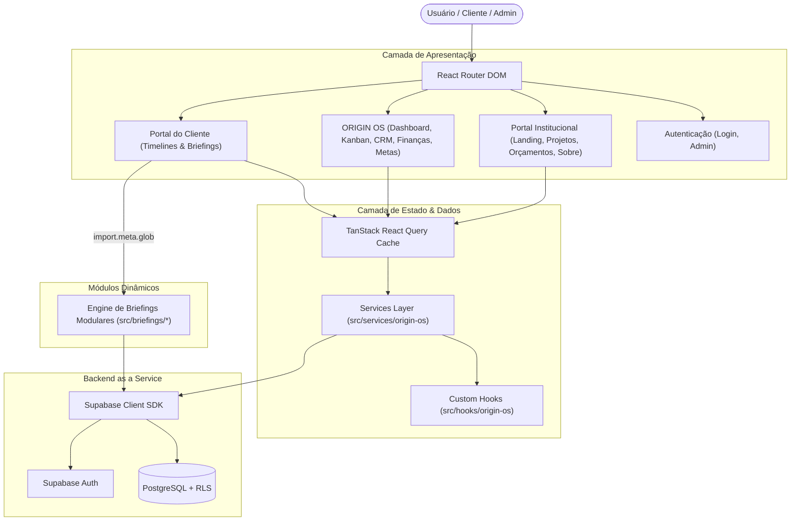

# OrigemDev — Plataforma Digital & Sistema Integrado

[](https://react.dev/)
[](https://www.typescriptlang.org/)
[](https://vitejs.dev/)
[](https://tailwindcss.com/)
[](https://supabase.com/)
[](https://tanstack.com/query/latest)

> Plataforma digital completa e ecossistema de soluções de desenvolvimento web/mobile sob medida da **OrigemDev**, integrando portal institucional, área de clientes com briefings modulares dinâmicos e o **ORIGIN OS**, um sistema operacional interno para gestão operacional, comercial e financeira de software house.

---

## 📌 Sumário

- [Sobre o Projeto](#-sobre-o-projeto)
- [Módulos da Aplicação](#-módulos-da-aplicação)
- [Stack Tecnológica](#-stack-tecnológica)
- [Arquitetura do Sistema](#-arquitetura-do-sistema)
- [Estrutura do Repositório](#-estrutura-do-repositório)
- [Instalação e Execução](#-instalação-e-execução)
- [Variáveis de Ambiente](#-variáveis-de-ambiente)
- [Scripts Disponíveis](#-scripts-disponíveis)
- [Decisões Técnicas de Engenharia](#-decisões-técnicas-de-engenharia)
- [Autoria & Contato](#-autoria--contato)

---

## 🚀 Sobre o Projeto

O **OrigemDev** foi concebido para centralizar e profissionalizar todas as etapas do ciclo de vida de uma software house boutique:
1. **Atração e Apresentação**: Portfólio de alta fidelidade com estética moderna (*Claymorphism* / Neumorphism suave), pré-visualização interativa de produtos web e mobile, e calculadora dinâmica de orçamentos.
2. **Onboarding e Acompanhamento de Clientes**: Área restrita para clientes com autenticação segura, acompanhamento de cronogramas/timelines de entrega em tempo real e formulários de briefing modulares.
3. **Gestão Operacional (ORIGIN OS)**: Painel interno de controle cobrindo prospecção, CRM, Kanban de desenvolvimento, produção de autoridade/conteúdo, notas com editor rico (TipTap), controle financeiro (DRE / fluxo de caixa) e acompanhamento de metas.

---

## 🧩 Módulos da Aplicação

### 1. Portal Institucional & Portfólio
- **Hero & Decoding Animation**: Animação de texto decodificador personalizada com framer-motion.
- **Showcase de Projetos**: Grid responsivo com alternância entre visualização desktop/mobile, tags tecnológicas e páginas de detalhes com case studies aprofundados.
- **Calculadora de Orçamentos**: Fluxo de múltiplos passos com cálculo estimado de escopo, prazos e faixas de investimento.
- **Depoimentos Reais**: Carrossel de validação social e feedbacks de clientes.

### 2. ORIGIN OS (Sistema Operacional de Gestão)
- **Dashboard & KPIs**: Indicadores-chave de desempenho, faturamento, conversões e gráficos analíticos (Recharts).
- **Planejamento**: Matriz de prioridades (P1, P2, P3), checklist diário e plano de ação semanal.
- **Prospecção & Follow-up**: CRM de leads com estágios de contato, histórico e lembretes de retorno.
- **Kanban de Produção**: Gestão visual de tarefas de desenvolvimento com arrastar e soltar (@dnd-kit).
- **Gestão Financeira**: Balanço de receitas, despesas, contas a receber, conciliação e métricas de margem.
- **Central de Anotações**: Editor rico de notas baseado em TipTap com salvamento automático e rascunhos em cache local.
- **Metas**: Gestão e acompanhamento do progresso de metas de curto, médio e longo prazo.

### 3. Portal do Cliente & Área Administrativa
- **Autenticação Segura**: Gerenciamento de sessões com Supabase Auth.
- **Timelines de Projeto**: Acompanhamento visual de fases de desenvolvimento (ex: Trilha NEF Seguros).
- **Briefings Modulares Dinâmicos**: Arquitetura orientada a plugins (`import.meta.glob`) que carrega automaticamente formulários de briefing específicos conforme o perfil do cliente logado.

### 4. Módulo de Parcerias & Estratégia Comercial
- **Kit de Guerra & Playbook**: Documentação estratégica de posicionamento, modelos de parceria e biblioteca de quebra de objeções.

---

## 🛠️ Stack Tecnológica

### Frontend
- **React 18.3** (Componentização funcional com Hooks e Context API)
- **TypeScript 5.8** (Tipagem estática estrita em toda a base)
- **Vite 5.4** com plugin `@vitejs/plugin-react-swc` (Compilação e HMR ultra-rápidos)
- **React Router Dom 6.30** (Roteamento baseado em rotas declarativas e lazy loading)

### UI, Design System & Animações
- **Tailwind CSS 3.4** (Utilitários de CSS e Design System consistente com variáveis HSL)
- **Radix UI & shadcn/ui** (Componentes acessíveis e customizáveis)
- **Framer Motion 11.18** (Animações declarativas e transições de página)
- **Lucide React** (Ícones SVG otimizados)
- **TipTap** (Editor WYSIWYG modular com extensões ricas)
- **Recharts 2.15** (Gráficos e visualizações de dados para dashboards)
- **Dnd-Kit** (Drag-and-drop moderno e acessível para o Kanban)

### Estado & Backend / Integrações
- **TanStack Query (React Query) v5** (Gerenciamento de cache, estado assíncrono e sincronização)
- **Supabase JS Client v2** (PostgreSQL, Autenticação, Row Level Security e Realtime)
- **React Hook Form + Zod** (Validação robusta de formulários e schemas)

### Tooling & Build
- **Terser** (Minificação e remoção de console/debugger em produção)
- **Vite Plugin Compression** (Compressão estática automatizada com Brotli e Gzip)
- **ESLint 9** + **TypeScript-ESLint** (Padronização e análise estática de código)
- **Vitest** (Suíte de testes automatizados com suporte nativo a ESM e JSDOM)

---

## 🏗️ Arquitetura do Sistema

A arquitetura do OrigemDev é desacoplada e baseada em camadas bem definidas:



---

## 📁 Estrutura do Repositório

```text
origemdev/
├── public/                     # Assets estáticos servidos diretamente (favicon, robots, etc.)
├── src/
│   ├── assets/                 # Imagens, vetores e mídias otimizadas da aplicação
│   ├── briefings/              # Módulos dinâmicos de briefings por cliente (plugin architecture)
│   │   ├── boyczuk/            # Briefing customizado com upload de referências e formulário em etapas
│   │   ├── dummy/              # Template de briefing modular para novos clientes
│   │   └── dummy2/             # Template e-commerce de briefing modular
│   ├── components/             # Componentes React reutilizáveis
│   │   ├── ui/                 # Primitivas de UI (Radix UI / shadcn)
│   │   ├── HeroSection.tsx     # Hero interativo com animação de decodificação
│   │   ├── Navbar.tsx          # Barra de navegação responsiva com smooth scroll
│   │   ├── ProjectsSection.tsx # Grid de projetos em destaque
│   │   └── ...
│   ├── data/                   # Datasets tipados estáticos (projetos, serviços)
│   ├── hooks/                  # Custom Hooks reutilizáveis
│   │   ├── origin-os/          # Hooks de negócios do ORIGIN OS (useCompanies, useFinancial, etc.)
│   │   └── useAutoSaveDraft.ts # Hook de auto-save com debounce no LocalStorage
│   ├── lib/                    # Configurações de bibliotecas (Supabase client, utils)
│   ├── pages/                  # Páginas e rotas da aplicação
│   │   ├── os/                 # Módulo completo do ORIGIN OS (Dashboard, Produzir, Finanças, etc.)
│   │   ├── parcerias/          # Módulo de Parcerias e Kit Comercial
│   │   ├── AdminArea.tsx       # Gestão administrativa de briefings e clientes
│   │   ├── ClientArea.tsx      # Área logada do cliente com carregador dinâmico de briefing
│   │   ├── Index.tsx           # Landing page principal
│   │   ├── Orcamentos.tsx      # Calculadora e formulário de orçamentos
│   │   └── Sobre.tsx           # Apresentação institucional da OrigemDev
│   ├── services/               # Camada de comunicação com APIs e Supabase
│   │   └── origin-os/          # Serviços REST/Supabase para cada domínio do ORIGIN OS
│   ├── test/                   # Configuração do ambiente de testes e specs Vitest
│   ├── types/                  # Definições de tipos TypeScript (origin-os.ts, etc.)
│   ├── App.tsx                 # Configuração de rotas, QueryClient e Providers globais
│   ├── index.css               # Design System, variáveis HSL e utilitários claymorphic
│   └── main.tsx                # Ponto de entrada da aplicação
├── .env.example                # Template documentado de variáveis de ambiente
├── eslint.config.js            # Configuração do ESLint 9 + TypeScript-ESLint
├── package.json                # Dependências e scripts do projeto
├── tailwind.config.ts          # Configuração de tema, cores HSL e animações Tailwind
├── tsconfig.json               # Configurações do compilador TypeScript
└── vite.config.ts              # Configuração do Vite, aliases, Terser e compressão Brotli/Gzip
```

---

## 💻 Instalação e Execução

### Pré-requisitos
- **Node.js**: Versão 18.0.0 ou superior (recomendado 20 LTS)
- **npm**, **pnpm** ou **yarn**

### 1. Clonar o Repositório
```bash
git clone https://github.com/rauanmartech/origemdev.git
cd origemdev
```

### 2. Instalar Dependências
```bash
npm install
```

### 3. Configurar Variáveis de Ambiente
Copie o arquivo de exemplo e insira as credenciais do seu projeto Supabase:
```bash
cp .env.example .env
```

### 4. Executar em Modo de Desenvolvimento
```bash
npm run dev
```
O servidor de desenvolvimento estará disponível em `http://localhost:8080` (ou `http://localhost:5173`).

---

## 🔐 Variáveis de Ambiente

| Variável | Descrição | Exemplo |
| :--- | :--- | :--- |
| `VITE_SUPABASE_URL` | URL base do seu projeto Supabase | `https://korfwyxfkmbwzwlukooz.supabase.co` |
| `VITE_SUPABASE_ANON_KEY` | Chave pública anônima da API Supabase (protegida por RLS) | `eyJhbGciOi...` |

---

## 📜 Scripts Disponíveis

| Comando | Descrição |
| :--- | :--- |
| `npm run dev` | Inicia o servidor de desenvolvimento com Hot Module Replacement (HMR) |
| `npm run build` | Compila o bundle otimizado de produção com minificação Terser e compressão Brotli/Gzip |
| `npm run preview` | Executa um servidor local para testar o build de produção gerado |
| `npm run lint` | Executa a verificação estática de código com ESLint |
| `npm run test` | Executa os testes automatizados com Vitest |

---

## 💡 Decisões Técnicas de Engenharia

1. **Code Splitting & Lazy Loading**:
   - Todas as páginas principais são importadas sob demanda via `React.lazy()` e encapsuladas em `<Suspense>`, reduzindo drasticamente o payload do bundle inicial e melhorando as métricas de Core Web Vitals (FCP e LCP).

2. **Arquitetura Dinâmica de Briefings (`import.meta.glob`)**:
   - Para permitir a expansão contínua de briefings sem poluir o roteamento estático, a área do cliente utiliza o recurso `import.meta.glob` do Vite para resolver e injetar componentes de briefing baseados no `username` do cliente logado.

3. **Gerenciamento Eficiente de Estado e Cache**:
   - Adoção de **TanStack Query v5** com `staleTime` configurado para 5 minutos e `gcTime` para 1 hora, eliminando requisições redundantes ao Supabase durante a navegação entre abas e módulos.

4. **Otimização de Build & Compressão**:
   - Configuração de Rollup manual chunks dividindo fornecedores pesados (`vendor`, `framer-motion`, `lucide`), além de pipeline automatizado de compressão com algoritmos **Brotli** e **Gzip** (`vite-plugin-compression`).

5. **Resiliência e Auto-Save**:
   - Implementação do custom hook `useAutoSaveDraft` em formulários críticos do ORIGIN OS, garantindo persistência imediata com *debounce* no LocalStorage para evitar perda de dados durante preenchimentos longos.

---

## 👨‍💻 Autoria & Contato

Desenvolvido por **Rauan Rocha** — Fundador & Tech Lead na **OrigemDev**.

- **Website**: [origemdev.com.br](https://www.origemdev.com.br/)
- **Instagram**: [@dev.rauan](https://instagram.com/dev.rauan)
- **WhatsApp**: [(71) 98378-9492](https://wa.me/5571983789492)
- **E-mail**: `rauanrocha.martech@gmail.com`

---

<div align="center">
  <sub>OrigemDev © Todos os direitos reservados. Soluções Digitais sob Medida.</sub>
</div>
